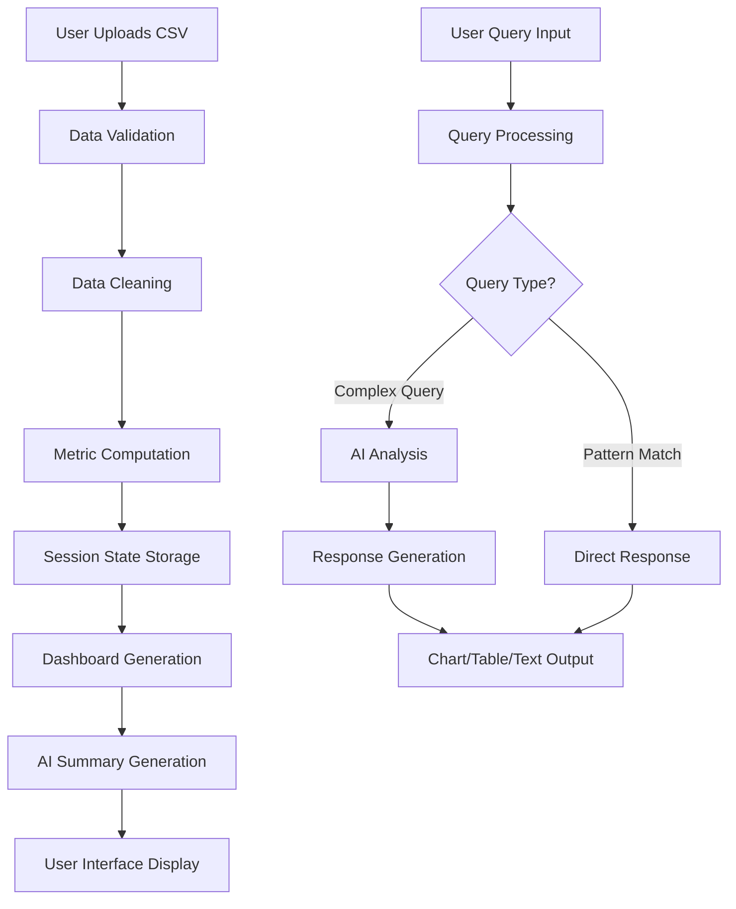

# Clinical Trial Analytics Demo - Architecture Guide

## 🏗 System Architecture Overview

The Clinical Trial Analytics Demo is built as a multi-layered web application using Streamlit as the frontend framework, with integrated AI capabilities for intelligent data analysis and reporting.

### Architecture Diagram

```
┌─────────────────────────────────────────────────────────────┐
│                    USER INTERFACE LAYER                     │
│  ┌─────────────┐  ┌─────────────┐  ┌─────────────────────┐  │
│  │   Upload    │  │  Dashboard  │  │   Interactive Q&A   │  │
│  │   Section   │  │   Charts    │  │     Engine          │  │
│  └─────────────┘  └─────────────┘  └─────────────────────┘  │
└─────────────────────────────────────────────────────────────┘
                               │
                               ▼
┌─────────────────────────────────────────────────────────────┐
│                 APPLICATION LOGIC LAYER                     │
│  ┌─────────────┐  ┌─────────────┐  ┌─────────────────────┐  │
│  │    Data     │  │   Query     │  │     Session         │  │
│  │ Processing  │  │ Processing  │  │   Management        │  │
│  │   Engine    │  │   Engine    │  │                     │  │
│  └─────────────┘  └─────────────┘  └─────────────────────┘  │
└─────────────────────────────────────────────────────────────┘
                               │
                               ▼
┌─────────────────────────────────────────────────────────────┐
│                   SERVICE INTEGRATION LAYER                 │
│  ┌─────────────┐  ┌─────────────┐  ┌─────────────────────┐  │
│  │  Azure      │  │   OpenAI    │  │     Chart           │  │
│  │  OpenAI     │  │    API      │  │   Generation        │  │
│  │   Service   │  │             │  │    Service          │  │
│  └─────────────┘  └─────────────┘  └─────────────────────┘  │
└─────────────────────────────────────────────────────────────┘
                               │
                               ▼
┌─────────────────────────────────────────────────────────────┐
│                     DATA LAYER                              │
│  ┌─────────────┐  ┌─────────────┐  ┌─────────────────────┐  │
│  │   CSV       │  │ Session     │  │     Generated       │  │
│  │   Files     │  │   State     │  │     Synthetic       │  │
│  │             │  │   Storage   │  │       Data          │  │
│  └─────────────┘  └─────────────┘  └─────────────────────┘  │
└─────────────────────────────────────────────────────────────┘
```

## 🔧 Component Breakdown

### 1. User Interface Layer (Streamlit Frontend)

#### **Upload Section** (`app.py:show_upload_section()`)
- **Purpose**: Handle CSV file uploads and data preview
- **Components**:
  - File uploader widget
  - Data validation and preview
  - Error handling and user feedback
- **Key Features**:
  - Support for various CSV formats
  - Automatic data type detection
  - Real-time preview of uploaded data

#### **Dashboard Section** (`app.py:show_dashboard()`)
- **Purpose**: Display key metrics and visualizations
- **Components**:
  - KPI cards (metrics display)
  - Pre-built chart visualizations
  - AI-generated summaries in tabs
- **Key Features**:
  - Responsive design
  - Real-time metric calculations
  - Interactive chart elements

#### **Interactive Q&A Engine** (`app.py:show_dashboard()` + `insights_engine.py`)
- **Purpose**: Process natural language queries
- **Components**:
  - Text input widget
  - Query processing engine
  - Dynamic response generation
- **Key Features**:
  - Natural language understanding
  - Dynamic chart generation
  - Contextual explanations

### 2. Application Logic Layer

#### **Data Processing Engine** (`utils/data_utils.py`)

```python
# Core Functions
clean_and_validate_data()  # Data cleaning and standardization
compute_metrics()          # Statistical calculations
get_data_summary()         # Data summarization for AI
filter_data()              # Dynamic data filtering
```

**Responsibilities**:
- Data cleaning and normalization
- Missing value imputation
- Data type standardization
- Metric calculation and aggregation
- Data validation and quality checks

**Data Flow**:
```
Raw CSV → Validation → Cleaning → Standardization → Metrics → Storage
```

#### **Query Processing Engine** (`utils/insights_engine.py`)

```python
# Core Functions
process_user_query()       # Main query processing
match_common_patterns()    # Pattern-based query matching
analyze_query_with_ai()    # AI-powered query analysis
execute_ai_analysis()      # Execute AI-generated instructions
```

**Query Processing Pipeline**:
1. **Input Normalization**: Clean and standardize user input
2. **Pattern Matching**: Check against common query patterns
3. **AI Analysis**: Use LLM for complex query understanding
4. **Execution**: Generate appropriate response (chart/table/text)
5. **Response Formatting**: Format output for UI display

### 3. Service Integration Layer

#### **AI Summary Service** (`services/ai_summary.py`)

**Architecture**:
```python
setup_openai_client()     # Client initialization
call_llm()                # API interaction
generate_summaries()      # Multi-audience reports
generate_custom_insight() # Query-specific insights
```

**AI Integration Flow**:
1. **Client Setup**: Initialize Azure OpenAI or OpenAI client
2. **Context Preparation**: Format data for LLM consumption
3. **Prompt Engineering**: Create targeted prompts for different use cases
4. **API Calls**: Execute LLM requests with error handling
5. **Response Processing**: Parse and format AI responses
6. **Fallback Handling**: Use templates when AI is unavailable

#### **Chart Generation Service** (`utils/chart_utils.py`)

**Chart Types Supported**:
- **Static Charts**: Pre-defined visualizations
- **Dynamic Charts**: User-query generated
- **Interactive Elements**: Hover, zoom, filter capabilities

```python
# Chart Functions
create_eligibility_funnel()    # Conversion funnel
create_dropout_risk_chart()    # Risk distribution
create_site_distribution()     # Site performance
create_custom_chart()          # Dynamic generation
create_correlation_heatmap()   # Data relationships
```

### 4. Data Layer

#### **Session State Management**
- **Storage**: Streamlit session state
- **Components**:
  - Uploaded data persistence
  - Computed metrics cache
  - AI summaries cache
  - User interaction state

#### **Data Sources**
- **Primary**: User-uploaded CSV files
- **Secondary**: Generated synthetic data
- **Format**: Pandas DataFrame for processing

## 🔄 Data Flow Architecture

### End-to-End Data Flow



### Session State Management

```python
# Session State Structure
{
    'data_uploaded': Boolean,
    'processed_data': pd.DataFrame,
    'metrics': Dict[str, Any],
    'ai_summaries': Dict[str, str],
    'query_history': List[Dict],
    'chart_cache': Dict[str, Figure]
}
```

## 🧠 AI Integration Architecture

### Multi-Provider Support

```python
# Provider Priority
1. Azure OpenAI (Primary)
2. OpenAI API (Fallback)
3. Template-based (No API)
```

### Prompt Engineering Strategy

**Executive Summary Prompt**:
- Focus: KPIs, strategic insights, recommendations
- Length: 100-150 words
- Audience: C-level executives, decision makers

**Clinical Summary Prompt**:
- Focus: Patient safety, protocol compliance, clinical outcomes
- Length: 100-150 words
- Audience: Clinical researchers, medical professionals

**Marketing Summary Prompt**:
- Focus: Recruitment metrics, site optimization, ROI
- Length: 100-150 words
- Audience: Marketing teams, business development

### Query Understanding Pipeline

```python
# Natural Language Processing Flow
User Query → Text Normalization → Pattern Matching → AI Analysis → Response Generation
```

## 📊 Visualization Architecture

### Chart Generation Strategy

1. **Pre-built Charts**: Static visualizations for common metrics
2. **Dynamic Charts**: Generated based on user queries
3. **Interactive Elements**: Plotly-powered interactivity

### Responsive Design

```css
/* Mobile-First Approach */
Base Styles → Tablet Styles → Desktop Styles
```

## 🔒 Security Considerations

### API Security
- Environment variable storage for API keys
- No hardcoded credentials
- Error handling prevents key exposure

### Data Privacy
- No persistent data storage
- Session-based data handling
- No external data transmission (except AI APIs)

## 📈 Performance Optimization

### Caching Strategy
- **Session State**: Computed metrics and AI summaries
- **Chart Cache**: Expensive visualizations
- **Data Processing**: Avoid reprocessing unchanged data

### Memory Management
- DataFrame operations optimized for memory usage
- Lazy loading of large datasets
- Garbage collection for unused objects

## 🔧 Configuration Management

### Environment-Based Configuration
```python
# config.py structure
- API credentials
- Chart styling
- Prompt templates
- Validation rules
```

### Feature Flags
```python
DEBUG_MODE = os.getenv("DEBUG_MODE", "False")
```

## 🚀 Deployment Architecture

### Development Environment
```bash
Local Machine → Streamlit Dev Server → http://localhost:8501
```

### Production Considerations
- **Containerization**: Docker support
- **Cloud Deployment**: Streamlit Cloud, AWS, Azure
- **Scaling**: Horizontal scaling for multiple users
- **Monitoring**: Error tracking and performance metrics

## 🔄 Extension Points

### Adding New Chart Types
1. Create function in `chart_utils.py`
2. Add pattern matching in `insights_engine.py`
3. Update UI components as needed

### Adding New AI Providers
1. Extend `ai_summary.py` with new client setup
2. Add provider-specific configuration
3. Implement fallback logic

### Adding New Data Sources
1. Extend `data_utils.py` with new loaders
2. Add validation for new formats
3. Update UI for new upload types

## 📝 Development Guidelines

### Code Organization
- **Separation of Concerns**: Each module has specific responsibilities
- **Modular Design**: Functions are reusable and testable
- **Error Handling**: Comprehensive error catching and user feedback

### Testing Strategy
- **Unit Tests**: Individual function testing
- **Integration Tests**: End-to-end workflow testing
- **User Acceptance Tests**: Demo scenario validation

### Documentation Standards
- **Docstrings**: All functions documented
- **Type Hints**: Clear parameter and return types
- **README**: Comprehensive setup and usage guide

---

This architecture provides a solid foundation for the demo while maintaining extensibility for future enhancements and production deployment.